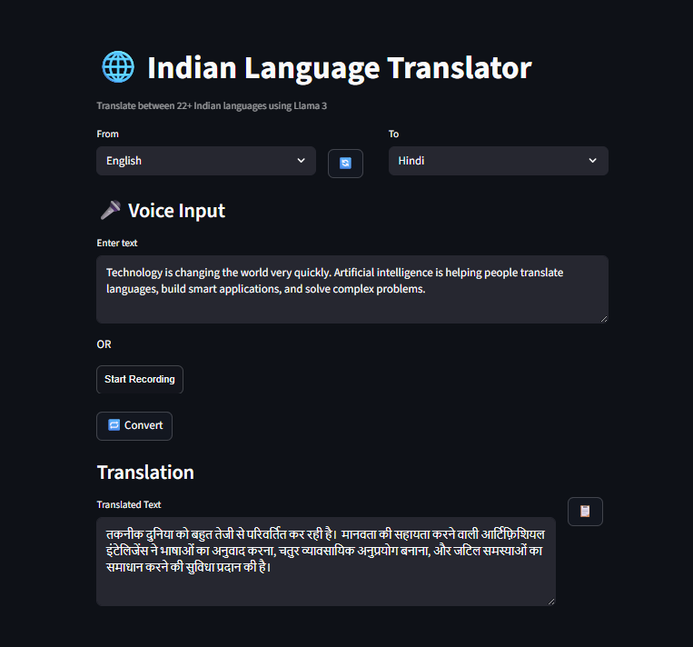

<<<<<<< HEAD
# 🌐 Indian Language Translator

A multilingual **AI-powered translation web app** that supports **22+ Indian languages** using **Llama 3 via Groq API**.
The application provides both **text input and voice input**, allowing users to translate spoken or written text instantly.

Built with **Streamlit + LangChain + Groq**.

---

## 🚀 Features

* 🌐 Translate between **22+ Indian languages**
* 🎤 **Voice input** using microphone
* ✍️ **Text input** for manual translation
* 🔄 **Swap languages** instantly
* ⚡ **Fast AI translation** powered by Groq Llama-3
* 📋 **Copy translated text** to clipboard
* 🖥 Clean and interactive **Streamlit UI**

---

## 🧠 Tech Stack

* **Python**
* **Streamlit**
* **LangChain**
* **Groq API**
* **Llama-3.1-8B-Instant**
* **SpeechRecognition**
* **streamlit-mic-recorder**

---

## 📸 Demo

(Add a screenshot of your app here)

Example:



---

## 📂 Project Structure

```
Indian-Language-Translator
│
├── test.py              # Main Streamlit application
├── requirements.txt    # Python dependencies
├── README.md           # Project documentation
└── .env.example        # Example environment variables
```

---

## ⚙️ Installation

Clone the repository

```bash
git clone https://github.com/rishavkumarseth2507/Indian-Language-Converter.git
cd Indian-Language-Converter
```

Create a virtual environment (optional but recommended)

```bash
python -m venv env
```

Activate environment

**Windows**

```bash
env\Scripts\activate
```

**Mac/Linux**

```bash
source env/bin/activate
```

Install dependencies

```bash
pip install -r requirements.txt
```

---

## 🔑 Setup Environment Variables

Create a `.env` file in the root folder.

Example:

```
GROQ_API_KEY=your_groq_api_key_here
```

---

## ▶️ Run the Application

```bash
streamlit run test.py
```

The app will open in your browser:

```
http://localhost:8501
```

---

## 🎤 How Voice Input Works

1. Click **Start Recording**
2. Speak into your microphone
3. Speech is converted to text
4. The text is translated using **Llama-3**
5. The translated text is displayed instantly

---

## 🌍 Supported Languages

Assamese
Bengali
Bodo
Dogri
Gujarati
Hindi
Kannada
Kashmiri
Konkani
Maithili
Malayalam
Manipuri
Marathi
Nepali
Odia
Punjabi
Sanskrit
Santali
Sindhi
Tamil
Telugu
Urdu
English

---

## 📈 Future Improvements

* 🔍 Auto language detection
* 🔊 Text-to-speech output
* 🌍 Real-time conversation mode
* ☁️ Cloud deployment
* 📜 Translation history

---

## 🤝 Contributing

Contributions are welcome!

If you'd like to improve this project:

1. Fork the repository
2. Create a new branch
3. Make your changes
4. Submit a pull request

---

## 📜 License

This project is open-source and available under the **MIT License**.

---

## 👨‍💻 Author

**Rishav Kumar**

If you like this project, consider giving it a ⭐ on GitHub!
=======
# Indian-Language-Converter
An AI-powered Indian language converter built with Streamlit and LLMs that translates text between multiple Indian languages with a simple web interface.
>>>>>>> 6468ee0c4bd07dac0aa56aae517a122d4e0ab78e
